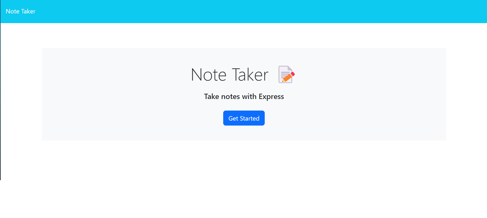
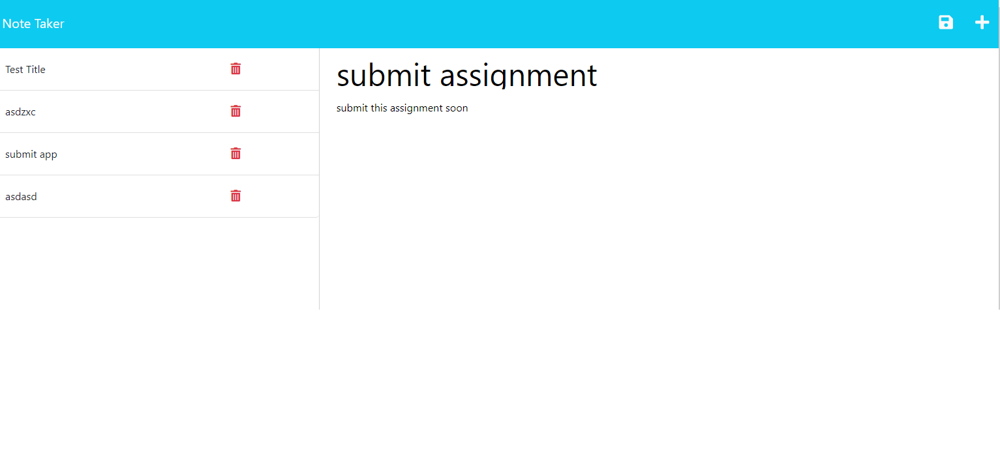

# Note Taker

## Project Description
If you need to take notes and keep them saved, this is the app for you!

## Table of Contents
* [Installation](#installation)
* [Usage](#usage)
* [Contributing](#contributing)
* [Test](#test)
* [Questions](#questions)
* [License](#license)

## Installation
Step 1: Run npm install and Step 2: Run node server.js

## Usage
* Simply get started with the app
* Write your note title and text
* Click on the save button to keep your note saved
  
## Check the live site [here](https://note-taker-tzh.herokuapp.com)
  
## Preview

## Questions 
If you have any questions, contact [thossain30](https://github.com/thossain30) on Github, or reach out via email at tamjidh99@gmail.com.

## License
This project is licensed by MIT
  
Click [here](https://opensource.org/licenses/MIT) for more information.
  

